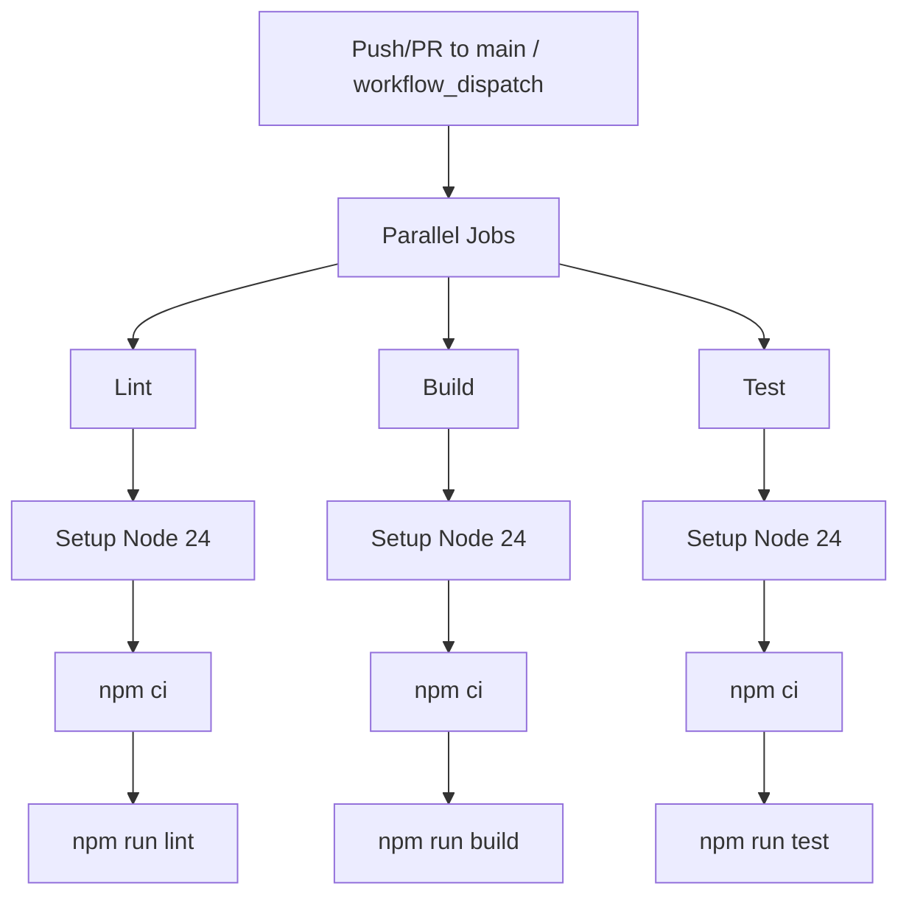

## Automated Testing & Build

`.github/workflows/ci.yml`

Executes automated linting, building, and unit testing on every push to `main` and on every pull request targeting `main`. A manual trigger is also available via `workflow_dispatch`.

**Jobs:**

| Job     | Purpose                                    |
| ------- | ------------------------------------------ |
| `lint`  | Runs `npm run lint` (Biome checks)         |
| `build` | Runs `npm run build` (tsup → dist/)        |
| `test`  | Runs `npm run test` (Vitest with coverage) |

All three jobs run in parallel on `ubuntu-latest` with Node.js 24.

