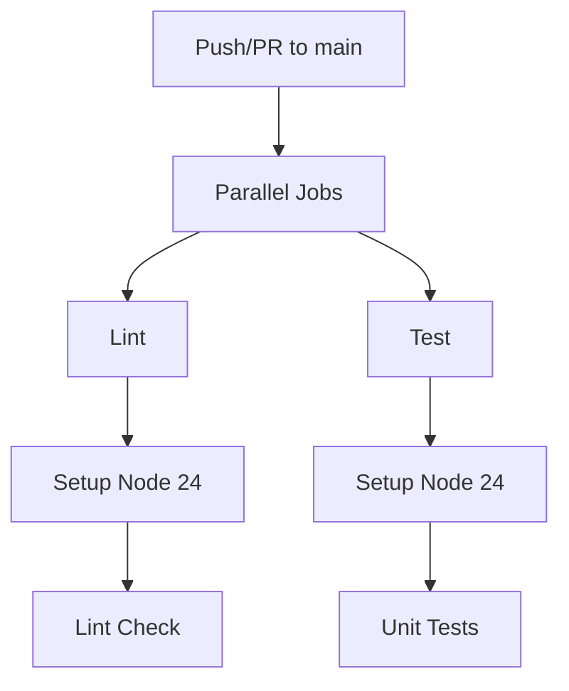

## Automated Testing & Build

`.github/workflows/ci.yml`

Executes automated linting and unit testing on push or pull request.

```mermaid
graph TD
    A[Push/PR to main] --> B[Parallel Jobs]
    B --> C[Lint]
    B --> D[Test]
        C --> C1[Setup Node 24]
        C1 --> C2[Lint Check]

        D --> D1[Setup Node 24]
        D1 --> D2[Unit Tests]
```
