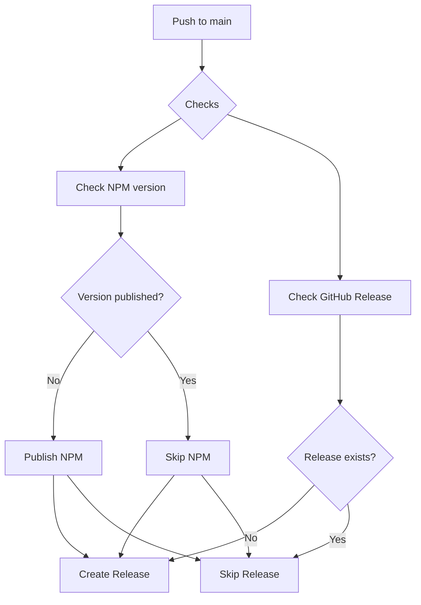

## Package Publication & Release

`.github/workflows/release.yml`

Manages NPM publishing and GitHub release tagging upon merge to main.

```mermaid
graph TD
    A[Push to main] --> B{Checks}
    B --> C[Check NPM version]
    B --> D[Check GitHub Release]
    C --> E{Version published?}
    D --> F{Release exists?}
    E -->|No| G[Publish NPM]
    E -->|Yes| H[Skip NPM]
    F -->|No| I[Create Release]
    F -->|Yes| J[Skip Release]
    G --> I
    H --> I
    H --> J
    G --> J
```
