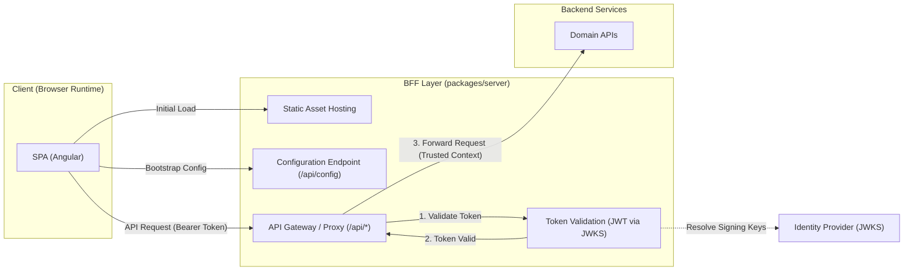

## bSPA - BFF Server Pattern for SPA Applications

bSPA (pronounced “spa”, with a silent b) is the new name for a small, lightweight Backend‑for‑Frontend (BFF) library. The name reflects the idea that the backend layer is so small and unobtrusive that it’s “barely there,” just like the silent b. The library provides a minimal, nested backend layer that sits directly behind a SPA (Single‑Page Application) and exposes client‑specific API endpoints, routing, and data shaping.

The purpose of bSPA is to offer a tiny, focused backend layer that lives inside a larger system but remains simple, cute, and easy to integrate. It is not a full framework; it is a helper layer designed to be embedded within an existing application structure.

### Architecture



### Repository Structure

| Package                   | Description                                           |
| ------------------------- | ----------------------------------------------------- |
| `src/`                    | bSPA BFF server library                               |
| `demo/angular-spa`        | Angular SPA consuming bSPA                            |
| `demo/backend`            | Example backend service proxied by bSPA                |

### Quick Start

```ts
import { createServer } from 'bspa';

const server = createServer({
  app: { spa: { root: './dist/browser' } }
});

await server.start();
```

### Endpoints

**Public endpoints** are defined in `api.routes` with `access: 'public'`. For example, a typical config endpoint:

```ts
api: {
  basePath: '/bff',
  routes: [
    { path: '/config', access: 'public', handler: myConfigHandler }
  ]
}
```

**Proxy endpoints** forward requests to backend services. These are defined in `proxy.routes`:

```ts
proxy: {
  basePath: '/api',
  routes: [
    { path: '/users', access: 'private', target: 'http://backend:3001' },
    { path: '/products', access: 'private', target: 'http://backend:3001' }
  ]
}
```

### Usage

**Development:** SPA dev server proxies API requests to BFF → BFF proxies to backend services.

**Production:** bSPA serves built SPA and handles all `/api` requests.

### When This Pattern Fits

- Multiple SPAs need similar server behavior
- Consistent API access patterns across apps
- Runtime configuration preferred over build-time injection
- Backend is separate (microservices, APIs)

Less useful when frontend and backend are tightly coupled, or highly customized server behavior is needed per app.

### Implementation

Built with Express + Zod. Pre-wired middleware and routing with sensible defaults. Designed to be extended, not replaced.
